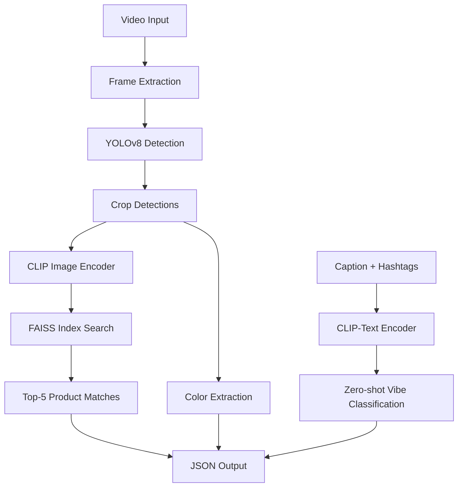

# FLICKD: AI Outfit Detection & Matching System

An end-to-end smart tagging pipeline for detecting, localizing, and matching fashion items from short-form video reels using YOLOv8, CLIP, and FAISS.

## Features

- **Real-time Fashion Detection**: YOLOv8 + OpenCV to detect and localize fashion items from video frames
- **Product Matching**: CLIP (ViT-B/32) embeddings with FAISS for top-5 similar SKU retrieval from 10K+ catalog
- **Vibe Classification**: Zero-shot fashion vibe classification using CLIP-Text from captions and hashtags
- **Color Extraction**: Dominant color detection from cropped fashion items
- **RESTful API**: FastAPI endpoint for video processing and inference

## How It Works



### Pipeline Overview

1. **Frame Extraction**: Videos are processed frame-by-frame at configurable intervals (default: 1 FPS) using OpenCV
2. **Object Detection**: YOLOv8 detects fashion items (tops, bottoms, dresses, jackets, accessories) and returns bounding boxes with confidence scores
3. **Image Cropping**: Detected items are cropped from frames with padding for better matching accuracy
4. **CLIP Encoding**: Cropped images are encoded into 512-dimensional embeddings using CLIP ViT-B/32
5. **Product Matching**: FAISS index searches for top-5 similar products using cosine similarity, classified as Exact (>0.9), Similar (0.75-0.9), or No Match (<0.75)
6. **Color Extraction**: Dominant colors are extracted from cropped detections using K-means clustering
7. **Vibe Classification**: CLIP-Text encoder analyzes captions and hashtags to classify videos into 1-3 fashion vibes (Coquette, Clean Girl, Cottagecore, Streetcore, Y2K, Boho, Party Glam)
8. **Output**: Structured JSON with detected vibes, matched products, colors, and confidence scores

## Output Format

```json
{
  "video_id": "abc123",
  "vibes": ["Coquette", "Y2K"],
  "products": [
    {
      "type": "dress",
      "color": "black",
      "match_type": "similar",
      "matched_product_id": "prod_456",
      "confidence": 0.84,
      "product_name": "Black Summer Dress"
    }
  ]
}
```

## Tech Stack

- **YOLOv8**: Object detection (ultralytics)
- **CLIP**: Image and text embeddings (open-clip-torch)
- **FAISS**: Vector similarity search
- **FastAPI**: REST API framework
- **OpenCV**: Video processing
- **scikit-learn**: Color extraction

## License

MIT License

## Author

Built for FLICKD AI Hackathon - IIT Delhi Startup

